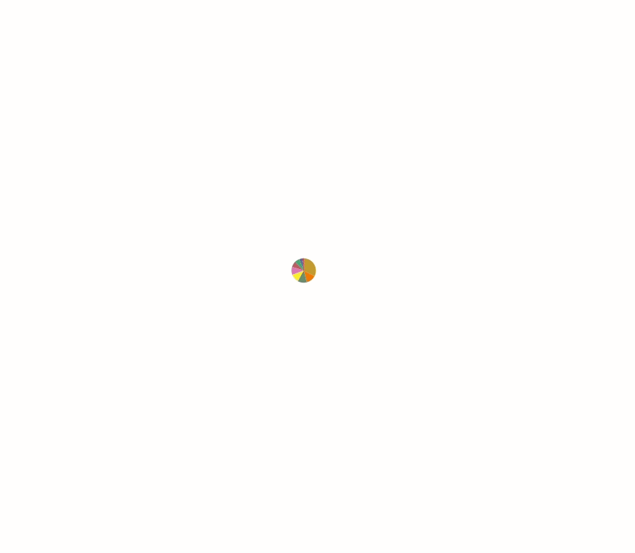

# too-many-cells-interactive


## About The Project

too-many-cells-interactive is an interactive visualization tool allowing users to explore cell cluster trees generated by [too-many-cells](https://github.com/GregorySchwartz/too-many-cells). 

### Built With

* [D3.js](https://d3js.org/)
* [React.js](https://reactjs.org/)
* [Redux.js](https://redux.js.org/)
* [Typescript](https://www.typescriptlang.org/)
* [Styled-Components](https://styled-components.com/)
* [Node.js](https://nodejs.org/en/)
* [PostgreSQL](https://www.postgresql.org/)
* [Docker](https://www.docker.com/)


## Running the application

To run the application, first make sure that you have [Docker](https://www.docker.com/) and [Docker-Compose](https://docs.docker.com/compose/install/) on your system. Before running the software, use [too-many-cells](https://github.com/GregorySchwartz/too-many-cells) to generate (among others) a `cluster_tree.json` file. You will also need a file called `labels.csv` as described in the [too-many-cells documentation](https://gregoryschwartz.github.io/too-many-cells/#:~:text=labels.csv). Optionally, you may also include the original matrix files, which will be used to populate a database of features that can overlay your cluster tree visualization. Depending on the size of these files, it may take a while for the database to populate. The current benchmark is about 100,000 entries per second.

All files, including the cluster tree, the labels, and the matrix files, should be located within a root directory on the host machine. If there are many matrix files, each set (the feature, matrix, and barcodes files) should be located within its own subdirectory. too-many-cells-interactive will scan the main directory and any subdirectories and import the files based on the naming convention. 

Example directory structure:


See [the import script](./node/import-matrix.py) for more details.

To build the images, provision the containers, and start the application, run the command `./start-and-load.sh` with the `--data-dir` and `--port` arguments. `--data-dir` should indicate the root directory where the required files are located on your host machine (they will be mounted into the docker container) and `--port` should be the port on which the React app will listen on localhost. Once the build and loading process is complete, you should be able to view the app at this location in a web browser.

```
├-my-matrices
|  ├-data
|   ├-droplet
|     ├-Bladder-10X_P4_3
|       | barcodes.tsv
|       | genes.tsv
|       | matrix.mtx
|     ├-Spleen-10X_P4_7
|       | barcodes.tsv
|       | genes.tsv
|       | matrix.mtx   
|--my-results
| | labels.csv
| | cluster_tree.json
```


Example: `./start-and-load.sh --matrix-dir /data/my-matrices --tree-path /data/my-results/cluster_tree.json --label-path /data/my-results/labels.csv --port 1234` 

**WARNING:** your matrix files will be mounted into the container and imported into a database stored in a Docker volume on your machine. Depending on the size of your files, this may result in substantial disk usage. To free up space, consider regularly purging unneeded volumes, containers, and/or images using the [docker system prune](https://docs.docker.com/engine/reference/commandline/system_prune/) command.

Once the container has been built and the matrices imported, you can restart the program without rebuilding and reloading by simply starting the containers: `docker-compose -f docker-compose.prod.yaml up` 


Note that the node image must be rebuilt locally anytime there is a code change.

## Generating images from the command line

It is now possible to generate svg images outside of the browser via the command line. If a template image has already been generated by the browser program, you can click on the "Export State" button in order to download a JSON representation of its configuration, which includes size, scale, feature, and other attributes, which can then be passed to the command-line program along with the other required parameters (i.e., paths to `cluster_tree.json` and `labels.csv`). If you wish to include feature values in your plot, you will need to ensure that the postgres database has been provisioned with the appropriate data ahead of time. For scripting batch outputs, the configuration JSON may be passed as stdin to the program, enabling modifications via a library like [jq](https://stedolan.github.io/jq/manual/). The [generate-svg.sh](generate-svg.sh) script provides a convenience wrapper around the fairly complex `docker-compose` command required to run the script and [sample-export-loop.sh](sample-export-loop.sh) demonstrates how multiple images might be generated by a single configuration file, in this case by substituting the features and overriding the out path to prevent overwrites. As with similar commands, this program will mount the designated input files and output directory into the container for processing.  

## Building the application for development

To build the application for development, you will need to provision the Docker containers, compile the Typescript, and load some sample feature data. 
  - the Docker configuration for development can be found in [docker-compose.yaml](./docker-compose.yaml). By default, the React application will listen on port 1212. You can change this value by creating an `.env` file and entering your own value for `REACT_PORT`. There is a sample `.env` file called `.env.sample` that can serve as a basis.
  - there is a helper script called `provision-dev.sh` that will build the images and bring up the containers. It should be passed a path to the directory that contains your data. For example: `./provision-dev.sh --data-dir /path/to/your/data`
  - when this script completes, the app will be accessible on port 1212 or the port specified in the `.env` file. Any changes made to the React or Node files locally will trigger a code recompilation.
  - You need to perform the provisioning process just once for a given dataset. Once the features are in the database and files moved into the static files directory, you only need to run `docker-compose up` to bring up the application. If you would like to import a new set of features, the easiest way to do so is to rerun the `provision-dev.sh` script, which will drop your previous data from the Postgres database.
