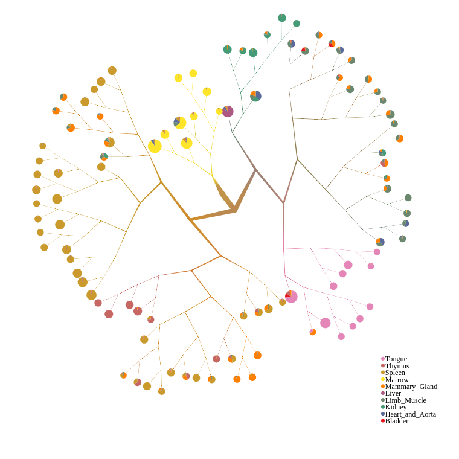

# too-manys-cells-js

## About The Project

too-many-cells-js is an interactive visualization tool allowing users to explore cell cluster trees generated by [too-many-cells](https://github.com/GregorySchwartz/too-many-cells). 

### Built With

* [D3.js](https://d3js.org/)
* [React.js](https://reactjs.org/)
* [Redux.js](https://redux.js.org/)
* [Typescript](https://www.typescriptlang.org/)
* [Styled-Components](https://styled-components.com/)
* [Node.js](https://nodejs.org/en/)
* [MongoDB](https://mongodb.com/)
* [Docker](https://www.docker.com/)

### Running the application

To run the application, first make sure that you have [Docker](https://www.docker.com/) and [Docker-Compose](https://docs.docker.com/compose/install/) on your system. Before running the software, use [too-many-cells](https://github.com/GregorySchwartz/too-many-cells) to generate (among others) a `cluster_tree.json` file. You will also need the `labels.csv` as described in the [too-many-cells documentation](https://gregoryschwartz.github.io/too-many-cells/#:~:text=labels.csv). Optionally, you may also include the original matrix files, which will be used to populate a database of features that can overlay your cluster tree visualization. Depending on the size of these files, it may take a little while for the database to populate. The current benchmark is about 100,000 entries per second. 

All files, including the cluster tree, the labels, and the matrix files, should be located within a single directory on the host machine. too-many-cells-js will scan this directory, including subdirectories, and import the files. See [the import script](./node/import-matrix.py) for details.

To build the images, provision the containers, and start the application, run the command `./start-and-load.sh` with the `--data-dir` and `--port` arguments. `--data-dir` should indicate the root directory where the required files are located on your host machine (they will be mounted into the docker container) and `--port` should be the port on which the React app will listen on localhost. Once the build and loading process is complete, you should be able to view the app at this location in a web browser.

### Building the application for development

To build the application for development, you will first need to provision the Docker containers, compile the Typescript, and load some sample feature data. 
  - the Docker configuration can be found in [docker-compose.yaml](./docker-compose.yaml). By default, the React application will listen on port 1212. You can change this value by creating an `.env` file and entering your own value for `REACT_PORT`. There is a sample `.env` file called `.env.sample` that can serve as a basis.
  - there is a helper script called `provision-dev.sh` that will build the images and bring up the containers. It should be passed a path to the directory that contains your data. For example: `./provision-dev.sh --data-dir /path/to/your/data`
  - when this script completes, the app will be accessible on port 1212 or the port specified in the `.env` file. Any changes made to the React or node files locally will cause the respective process to update.
  - note that only the `/src` directory is mounted into the `node` container, so if you alter any files (scripts, config) outside of this directory, you will need to rebuild the image before these changes take effect.
  - You need to perform the provisioning process just once for a given dataset. Once the features are in the database and files moved into the static files directory, you only need to run `docker-compose up` to bring up the application.
  - note that the `provision-dev.sh` script will truncate the feature database, since it should only be run when a new dataset is being loaded.
