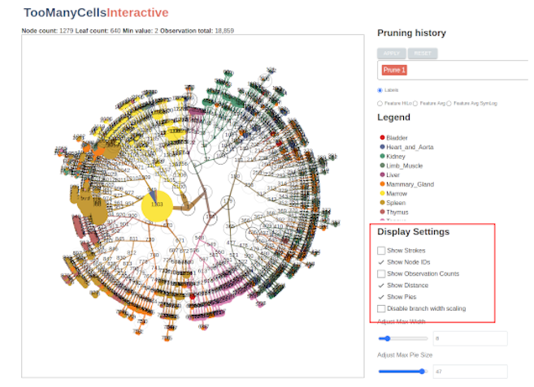
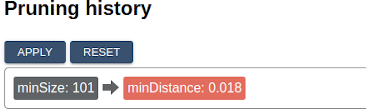
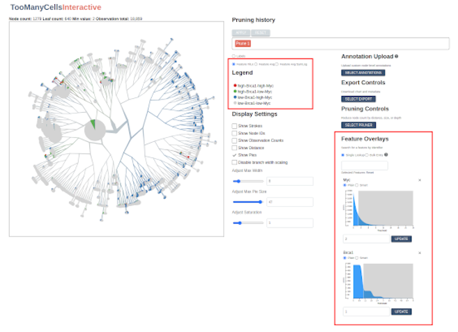

# too-many-cells-interactive


## About The Project

too-many-cells-interactive is an interactive visualization tool allowing users to explore cell cluster trees generated by [too-many-cells](https://github.com/GregorySchwartz/too-many-cells). 

### Built With

* [D3.js](https://d3js.org/)
* [React.js](https://reactjs.org/)
* [Redux.js](https://redux.js.org/)
* [Typescript](https://www.typescriptlang.org/)
* [Styled-Components](https://styled-components.com/)
* [Node.js](https://nodejs.org/en/)
* [PostgreSQL](https://www.postgresql.org/)
* [Docker](https://www.docker.com/)


## Running the application

To run the application, first make sure that you have [Docker](https://www.docker.com/) and [Docker-Compose](https://docs.docker.com/compose/install/) on your system. Before running the software, use [too-many-cells](https://github.com/GregorySchwartz/too-many-cells) to generate (among others) a `cluster_tree.json` file. The application needs access to this files as well as a file called `labels.csv` as described in the [too-many-cells documentation](https://gregoryschwartz.github.io/too-many-cells/#:~:text=labels.csv) in order to display results. Optionally, you may also include the original matrix files, which will be used to populate a database of features that can overlay your cluster tree visualization. Depending on the size of these files, it may take a while for the database to populate. The current benchmark is about 100,000 entries per second.

The simplest way to get your `cluster_tree.json` and `labels.csv` onto the app server and, optionally, upload your matrix files to the database, is to use [the convenience wrapper script](./start-and-load.sh). This script takes three required arguments: the path to the `labels.csv` file, the path to the `cluster_tree.json` file and the port on which the server will listen on your localhost. You may also include the directory path where your matrix files are stored, in which case they will be imported into the database before the app runs. 

Example: `./start-and-load.sh --matrix-dir /path/to/my-matrix/dir --tree-path /path/to/cluster_tree.json --label-path /path/to/labels.csv --port 1234` 

When you are finished with the application, the postgres container will need to be stopped manually by running `docker-compose stop postgres` from the project root.

**WARNING:** your matrix files will be mounted into the container and imported into a database stored in a Docker volume on your host machine. Depending on the size of your files, this may result in substantial disk usage. To free up space, consider regularly purging unneeded volumes, containers, and/or images using the [docker system prune](https://docs.docker.com/engine/reference/commandline/system_prune/) command.

Once the container has been built and the matrices imported, you can restart the program without rebuilding and reloading by simply restarting the services with the command `docker-compose up -f docker-compose.prod.yaml` from inside the project root.

Note that the node image must be rebuilt locally any time there is a code change. This is handled by the `start-and-load.sh` script as well. 

## Generating images from the command line

too-many-cells-interactive makes it possible to batch-generate SVG images based on configurations set by the browser tool. Once you have satisfied by the browser program, you can choose "Export Image Configuration" from the "Select Export" menu in order to download a JSON representation of the graphic which can then be passed to the command-line program along with the other required parameters (i.e., paths to `cluster_tree.json` and `labels.csv`). If you wish to include feature values in your plot, you will need to ensure that the PostgreSQL database has been provisioned with the appropriate data ahead of time. For scripting batch outputs, the configuration JSON may be passed as stdin to the program, enabling modifications via a library like [jq](https://stedolan.github.io/jq/manual/). The [generate-svg.sh](generate-svg.sh) script provides a convenience wrapper around the fairly complex `docker-compose` command required to run the script and [sample-export-loop.sh](sample-export-loop.sh) demonstrates how multiple images might be generated by a single configuration file, in this case by substituting the features and overriding the out path to prevent overwrites. As with similar commands, this program will mount the designated input files and output directory into the container for processing.  

## Building the application for development

To build the application for development, you will need to provision the Docker containers, compile the Typescript, and mount your `cluster_tree.json` and `labels.csv` files into the node server's `static/files` directory. To do so, you may simply copy them into `<project-root>/node/static/files`, since the the [development docker-compose](docker-compose.yaml) file mounts the host's entire `node` directory into the container.  
  - the Docker configuration for development can be found in [docker-compose.yaml](./docker-compose.yaml). Unlike the 'production' configuration, the development setup splits the javascript code into front-end (React) and back-end (Node) containers. By default, the React application will listen on port 1212. You can change this value by creating an `.env` file and entering your own value for `REACT_PORT`. There is a sample `.env` file called `.env.sample` that can serve as a basis.
  - You need to perform the provisioning process just once for a given dataset. Once the features are in the database and files moved into the `/node/static/files` directory, you only need to run `docker-compose up` to bring up the application. If you would like to import a new set of features, the easiest way to do so is to rerun the `start-and-load.sh` script, which will drop your previous data from the PostgreSQL database and import new data. Your dev application will use this same data when you bring it up with `docker-compose up`.

## Tutorial

For this tutorial we are going to explore data from the [Tabula Muris](https://tabula-muris.ds.czbiohub.org/) project, so our first step will be to fetch the data from the remote server and store it in our current working directory as a zip archive called `tabula-muris.zip`:

```bash
wget -O tabula-muris.zip https://figshare.com/ndownloader/articles/5968960/versions/3
```

Next, we'll unzip the archive and then unzip the data files themselves:

```bash
unzip -d tabula-muris tabula-muris.zip
cd tabula-muris
unzip droplet.zip
```

We're also going to be installing the software using [Docker](https://www.docker.com/) and [Docker-Compose](https://docs.docker.com/compose/install/). These are widely-used and widely-trusted containerization tools that make it easy to build and run software in a range of host environments. Before proceding further, please make sure that both programs are installed on your system. 

Before we can begin exploring the data, we will need to use the primary TooManyCells program in order to create the `labels.csv` and `cluster_tree.json` files. Please follow the latest [TooManyCells documentation](https://gregoryschwartz.github.io/too-many-cells/) for instructions on how to do this.

Now, with your matrix files, `labels.csv`, and `cluster_tree.json` in hand, we're ready to start! 

Let's pull in the latest TooManyCellsInteractive code:

```bash
  git clone git@github.com:schwartzlab-methods/too-many-cells-interactive.git
  cd too-many-cells-interactive
```

We're going to get things started by running a script that does a few things:
1. Create the TooManyCellsInteractive Docker image.
2. Start the main TooManyCellsInteractive Docker container, along with the PostGreSQL container that will store our expression data. 
3. Load the tabula muris matrix data into the PostgreSQL database for fast querying.
4. Move our `labels.csv` and `cluster_tree.json` into our containerized static file server.
5. Start our visualization server, which will listen by default at `localhost:1212`.

From the project root (the main directory of the git repository we just cloned), run the following script **with the placeholder arguments replaced by paths to the corresponding files on your host system**. 

Before proceding, please note that in order for the containerized process to access your files, your files will need to be mounted into the Docker container. The matrix files will be decompressed (if necessary) and moved into a database, where they will be persisted in a Docker volume. Depending on the size of your matrix files, this may result in substantial disk usage. Note that you can always remove unused images, volumes, containers, and networks using the [docker system prune](https://docs.docker.com/engine/reference/commandline/system_prune/) command.

```bash
`./start-and-load.sh \
  --matrix-dir /path/to/my-matrix/dir \
  --tree-path /path/to/cluster_tree.json \
  --label-path /path/to/labels.csv \
  --port 1212`
```
If all has gone well, you should see a message in your terminal saying that the app is running. To confirm, navigate to [localhost:1212](http://localhost:1212) in a web browser. You should see something like this:


### Let's start by looking at a few basic controls:

1. The left-hand panel displays the matrix data as a radial tree. Using your mouse or touchpad, trying zooming, panning, and dragging nodes to new positions.
2. Hover over a node to see related metadata, including feature counts and label percentages.
3. Create a simple export by clicking the "Select Export" button from the right-hand-side control panel and choosing "Export as PNG." 

We can adjust basic display features using the controls to the right of the tree display panel. Here you will see options for viewing node IDs, feature counts, and modularity indicators:



You can also change the scaling ranges for the pie charts and branchs:


...or disable them altogether:


There's even the option to change the colors associated with a given label by clicking on the color swatch in the legend:


### The pruning controls

One of the most powerful features of TooManyCellsInteractive is the ability to filter nodes in real time (known sometimes as "pruning"). You can choose a pruner by clicking on the "Select Pruner" button. Let's start with a simple prune by size. Using the slider or the input box, select a maximum size and observe how the tree updates to fit your specification. Note that you may also select the "Smart" option on the selection slider, which allows you to select a minimum distance from the median in terms of the Median Absolute Deviation. Thus, selecting a minimum MAD distance of -3 will prune all nodes that are 3 MADs smaller than the median. Similarly, selecting a minimum "Smart" distance of 3 will remove all nodes whose size is less than 3 MADs greater than the median. 


Once you're satisfied with your prune, click the "Apply" button at the top. Notice that the indicator in the top row records each "Applied" prune as a separate step. Clicking "Reset" will return the image to its original state, while clicking on a specific step will return the image to the corresponding pruning state. This way, prunes of different types can be applied incrementally and reverted. Try adding another one and committing it now.



### Feature overlaps

When we ran the initial `start-and-load.sh` script, we imported millions of gene expression records into our PostgreSQL database. Now let's use TooManyCellsInteractive to evaluate them. Using the input box in the section labeled "Feature Overlays", search for a gene such as "Brca2" or "Apoe". Once selected, the application will fetch the corresponding values from the database and display their values on a sequential scale from gray to red, with red indicating relatively high feature expression and gray indicating relatively low feature expression: 


In the "Legend" panel, one can toggle back to the label scale for comparison or view feature distributions in terms of a symlog scale or an ordinal scale indicating high or low expression of a given feature or feature combinations (the slider in the Feature Overlays section are can be used to dynamically set this high/low threshold): 



Now try adding a second and third feature. The application will calculate a new running average each time a new feature set is added.

### Batch exporting

Once you have found a satisfactory combination of prunes, features, and colors, you can export the image configuration to JSON and use it to generate similar graphics from an arbitrary set of files and/or features. To do so, simply select "Export Image Configuration" from the "Select Export" menu. Then pass the exported JSON file to the "headless" image generation script. For convenience, the code repository includes a script called [generate-svg.sh](./generate-svg.sh). To recreate your image from the command line, execute the following in the project root, substituting your local file paths for the examples provided.

```bash
  ./generate-svg.sh \
    --label-path /path/to/labels.csv \
    --config-path /path/to/config/export.json \
    --tree-path /path/to/cluster_tree.json \
    --out-path /path/to/local/output/folder/filename.svg \
    --no-build
```

By wrapping a command like this in a simple loop, you can create similar images from different trees, labels, or feature sets.
