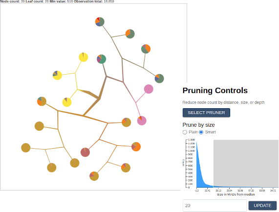

## Tutorial

For this tutorial we are going to explore data from the [Tabula Muris](https://tabula-muris.ds.czbiohub.org/) project. You can download the matrix files by using the commands below.

```bash
wget -O tabula-muris.zip https://figshare.com/ndownloader/articles/5968960/versions/3
unzip -d tabula-muris tabula-muris.zip
cd tabula-muris
unzip droplet.zip
```

Before we can begin exploring the data, we will need to do some preprocessing on our matrices, which, among others, will generate the required `labels.csv` and `cluster_tree.json` files. If you'd like to create these files yourself, please follow the latest [TooManyCells documentation](https://gregoryschwartz.github.io/too-many-cells/) for instructions. Otherwise you can download the files here: <a download href="./files/cluster_tree.json">cluster_tree.json</a> and <a download href="./files/labels.csv">labels.csv</a>.


We're going to be installing the software using [Docker](https://www.docker.com/) and [Docker-Compose](https://docs.docker.com/compose/install/). These are widely-used and widely-trusted containerization tools that make it easy to build and run software in a range of host environments. Before proceding further, please make sure that both programs are installed on your system.

Now, with Docker, your matrix files, `labels.csv`, and `cluster_tree.json` in hand, we're ready to start!

Let's pull in the latest TooManyCellsInteractive code:

```bash
  git clone git@github.com:schwartzlab-methods/too-many-cells-interactive.git
  cd too-many-cells-interactive
```

We're going to get things started by running a script that does a few things:
1. Create the TooManyCellsInteractive Docker image.
2. Start the main TooManyCellsInteractive Docker container, along with the PostGreSQL container that will store our expression data.
3. Load the tabula muris matrix data into the PostgreSQL database for fast querying.
4. Move our `labels.csv` and `cluster_tree.json` into our containerized static file server.
5. Start our visualization server, which will listen by default at `localhost:1212`.

From the project root (the main directory of the git repository we just cloned), run the following script **with the placeholder arguments replaced by paths to the corresponding files on your host system**.

Before proceding, please note that in order for the containerized process to access your files, your files will need to be mounted into the Docker container. The matrix files will be decompressed (if necessary) and moved into a database, where they will be persisted in a Docker volume. Depending on the size of your matrix files, this may result in substantial disk usage. Note that you can always remove unused images, volumes, containers, and networks using the [docker system prune](https://docs.docker.com/engine/reference/commandline/system_prune/) command.

```bash
./start-and-load.sh \
  --matrix-dir /path/to/my-matrix/dir \
  --tree-path /path/to/cluster_tree.json \
  --label-path /path/to/labels.csv \
  --port 1212
```

If all has gone well, you should see a message in your terminal saying that the app is running. To confirm, navigate to [localhost:1212](http://localhost:1212) in a web browser. You should see something like this:


### Let's start by looking at a few basic controls:

1. The left-hand panel displays the matrix data as a radial tree. Using your mouse or touchpad, trying zooming, panning, and dragging nodes to new positions.
2. Hover over a node to see related metadata, including feature counts and label percentages.
3. Create a simple export by clicking the "Select Export" button from the right-hand-side control panel and choosing "Export as PNG".

We can adjust basic display features using the controls to the right of the tree display panel. Here you will see options for viewing node IDs, feature counts, and modularity indicators:


You can also change the scaling ranges for the pie charts and branchs:


...or disable them altogether:


There's even the option to change the colors associated with a given label by clicking on the color swatch in the legend:


### The pruning controls

One of the most powerful features of TooManyCellsInteractive is the ability to collapse subtrees in real time (known sometimes as "pruning"). You can choose a pruner by clicking on the "Select Pruner" button. Let's start with a simple prune by size. Using the slider or the input box, select a maximum size and observe how the tree updates to fit your specification. Note that you may also select the "Smart" option on the selection slider, which allows you to select a minimum distance from the median in terms of the median absolute deviation (MAD). For example, selecting a minimum MAD distance of -3 will prune all nodes that are 3 MADs smaller than the median. Similarly, selecting a minimum "Smart" distance of 3 will remove all nodes whose size is less than 3 MADs greater than the median.



Once you're satisfied with your prune, click the "Apply" button at the top. Notice that the indicator in the top row records each "Applied" prune as a separate step. Clicking "Reset" will return the image to its original state, while clicking on a specific step will return the image to the corresponding pruning state. This way, prunes of different types can be applied incrementally and reverted. Try adding another one and committing it now.


### Feature overlays

When we ran the initial `start-and-load.sh` script, we imported millions of gene expression records into our PostgreSQL database. Now let's use TooManyCellsInteractive to evaluate them. Using the input box in the section labeled "Feature Overlays", search for a gene such as *BRCA2* or *APOE*. Once selected, the application will fetch the corresponding values from the database and display their values on a sequential scale from gray to red, with red indicating relatively high feature expression and gray indicating relatively low feature expression:


In the "Legend" panel, one can toggle back to the label scale for comparison or view feature distributions in terms of a symlog scale or an ordinal scale indicating high or low expression of a given feature or feature combinations (the slider in the Feature Overlays section are can be used to dynamically set this high/low threshold):


Now try adding a second and third feature. The application will calculate a new running average each time a new feature set is added.

### Annotation overlay

New for TooManyCellsInteractive trees only, you can overlay custom values on top of each node. Using the "Annotation Upload" feature, you can "Select Annotations" by choosing a CSV file with two columns, `node_id` and `value`, such that a new color scale will range over these values per node. This feature is useful for overlaying [Gene Set Enrichment Analysis (GSEA)](https://www.gsea-msigdb.org/gsea/index.jsp) for each node (getting the differential expression of one vs. all from `too-many-cells`, for instance), highlighting specific nodes, or in general annotating inner nodes rather than averages of individual cells.

### Batch exporting

Once you have found a satisfactory combination of prunes, features, and colors, you can export the image configuration to JSON and use it to generate similar graphics from an arbitrary set of files and/or features. To do so, simply select "Export Image Configuration" from the "Select Export" menu. Then pass the exported JSON file to the "headless" image generation script. For convenience, the code repository includes a script called `generate-svg.sh`. To recreate your image from the command line, execute the following in the project root, substituting your local file paths for the examples provided.

```bash
  ./generate-svg.sh \
    --label-path /path/to/labels.csv \
    --config-path /path/to/config/export.json \
    --tree-path /path/to/cluster_tree.json \
    --out-path /path/to/local/output/folder/filename.svg \
    --no-build
```

By wrapping a command like this in a simple loop, you can create similar images from different trees, labels, or feature sets.
